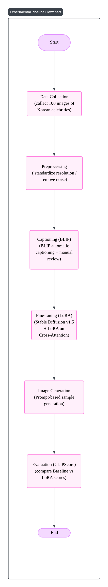
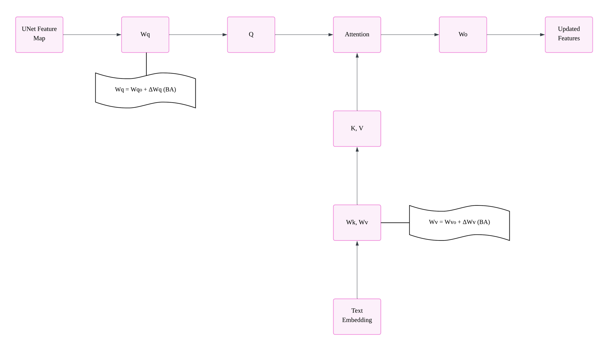

<h1 align="center">$\bf{\large{\color{#6580DD} LoRA-Fine Tuning-for-Stable Diffusion}}$</h1>
<h1 align="center">$\bf{\large{\color{#6580DD} (CaptionAware-Face Style-Adaptation)}}$</h1>

<!-- # LoRA Fine-tuning for Stable Diffusion (Caption-aware Face Style Adaptation) -->

### Caption-aware LoRA Fine-tuning Project

> Few-Shot 환경에서 텍스트-이미지 생성 품질을 향상시키기 위한 Cross-Attention LoRA 실험 프로젝트

---

## Overview

이 프로젝트는 **소량 이미지(100장)만으로 Stable Diffusion의 얼굴 생성 품질을 개선하기 위한 LoRA Fine-tuning 실험**입니다.  
특히 **Cross-Attention(Wq, Wv)** 레이어에 LoRA를 적용하여 **Prompt 반영률(semantic alignment)** 과 **identity consistency**를 높이는 것을 목표로 했습니다.

본 실험은 텍스트-이미지 생성 모델의 **데이터 효율화(PEFT)** 전략을 구조적으로 검증하기 위한 것입니다.

### Key Features

- **LoRA(PEFT)** 기반 저랭크 파인튜닝
- **Cross-Attention(Wq/Wv)** 대상 적용 및 rank/α 조절 실험
- **BLIP caption + 수동 검수** 기반 Caption-aware dataset 구성
- **CLIPScore 기반 자동 평가 파이프라인 구현**
- **Baseline vs LoRA 품질 비교**

---

## 프로젝트 구조

```plaintext
.
├── README.md
│
├── datasets/
│   ├── images/                 # 100 training images
│   ├── captions_example.json
│   ├── metadata_example.csv    # BLIP + manual revised captions
│   └── README.md
│
├── lora/
│   └── .gitkeep
│
├── src/
│   ├── train_lora.py           # LoRA fine-tuning script
│   ├── inference.py
│   └── evaluate_clip.py
│
└── results/
    ├── baseline_01.png
    ├── lora_01.png
    ├── clip_comparison.png
    └── examples.png

└── notebooks/clipscore_...ipynb는 실험 로그 참고용
```

### Dataset & Captioning

- 총 100장의 한국 여자 연예인 얼굴 이미지 사용
- 조명, 각도, 해상도 등을 기준으로 수동 필터링 후 학습용으로 선정
- BLIP으로 1차 caption 생성 후, 노이즈가 심한 일부 샘플은 수동으로 수정
- 캡션은 얼굴 identity를 직접적으로 드러내기보다, 헤어/표정/조명 등 스타일 위주로 기술

> 레포에는 저작권 이슈를 피하기 위해 `datasets/captions_example.json`, `metadata_example.csv`로
> **데이터 구조 샘플만** 포함합니다.

### Training Details

- `accelerate` 기반 mixed-precision(FP16) 학습 및 gradient accumulation 적용
- `CaptionedDataset`으로 이미지/캡션을 `metadata.csv`, `captions.json`에서 직접 로딩
- UNet의 Cross-Attention 모듈(`attn1`, `attn2`)에만 `LoRAAttnProcessor` 적용
- 학습 종료 후 LoRA 파라미터만 필터링해 별도 디렉터리에 저장하여,
  base 모델과 독립적으로 로드/적용 가능하도록 설계

## ▶ How to Run

### 1) LoRA Training

```bash
# Colab 사용
# 경로 수정해서 사용
!accelerate launch content/train_lora.py \
  --pretrained_model_name_or_path=runwayml/stable-diffusion-v1-5 \
  --instance_data_dir=content/idol_faces_clean \
  --output_dir=content/lora_outputs \
  --caption_file=captions.json \
  --resolution=384 \
  --train_batch_size=1 \
  --num_train_epochs=10 \
  --learning_rate=5e-5 \
  --mixed_precision="fp16" \
  --gradient_accumulation_steps=2 \
  --lr_scheduler="constant" \
  --checkpointing_steps=100 \
  --rank=4 \
  --alpha=8


python src/inference.py \
  --pretrained_model runwayml/stable-diffusion-v1-5 \
  --lora_weights ./lora_weights \
  --prompt "korean actress, natural daylight portrait"


python src/evaluate_clip.py --images_dir ./results

```

## 실험 파이프라인

<!--  -->


## LoRA in Cross-Attention

아래 그림은 Stable Diffusion UNet의 Cross-Attention 블록에서
Query/Value projection에만 LoRA를 적용한 구조를 나타냅니다.



- Text encoder에서 나온 embedding이 K, V로 들어가고,
- UNet latent가 Q로 투입됩니다.
- 이때 Q, V projection layer에만 ΔW = BA 형태의 LoRA를 적용해
  텍스트 조건 반영 경로만 선택적으로 보정합니다.

## Performance (CLIPScore)

| Model           | CLIPScore        |
| --------------- | ---------------- |
| Baseline        | 0.51             |
| LoRA Fine-tuned | **0.55 (+7.8%)** |

**→ caption-aware fine-tuning이 identity 유지 및 스타일 반영에 효과적임을 확인**

---
